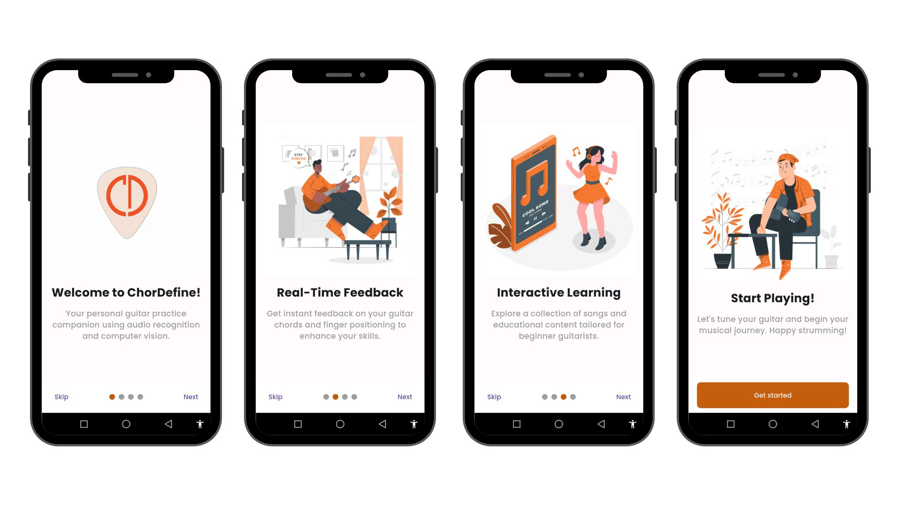
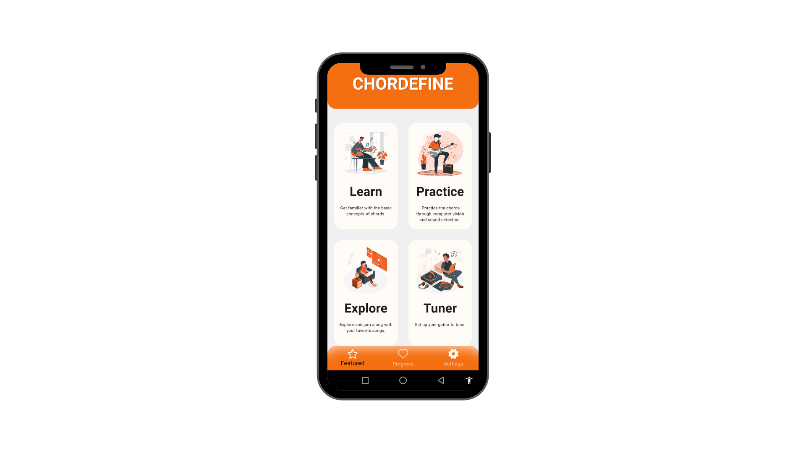
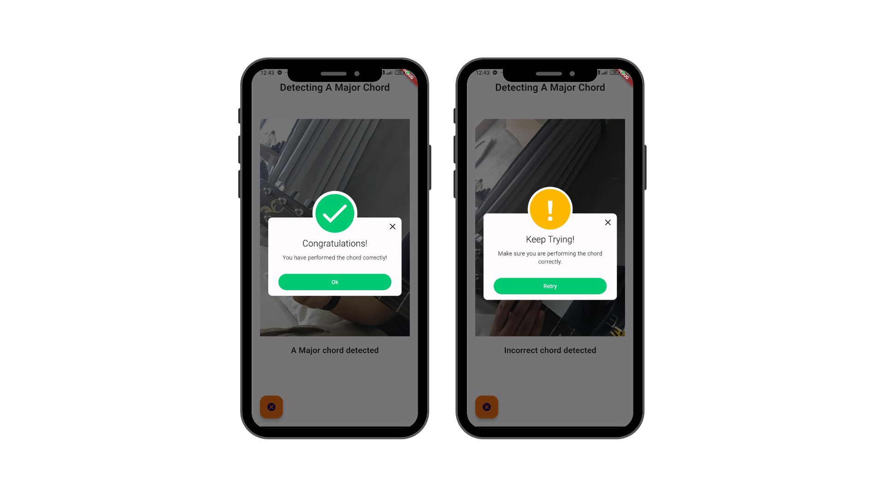
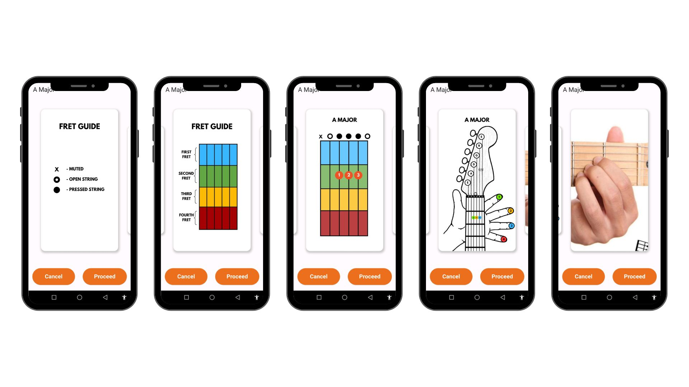
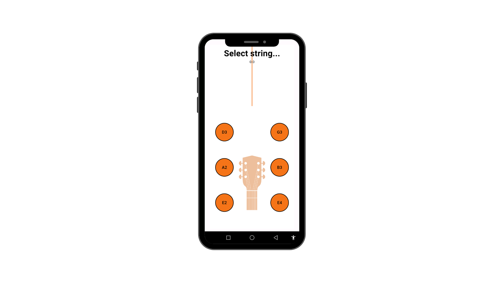

# ChorDefine
### ChorDefine: A Mobile Application for Guitar Chord Practice and Training Using Computer Vision and Audio Recognition

---

## 📌 Overview

**ChorDefine** is a mobile application designed to help guitarists of all skill levels learn, practice, and master chords with the power of computer vision and real-time audio recognition. Using your device’s camera and microphone, ChorDefine analyzes your hand positioning and chord strumming, giving you instant feedback to accelerate your progress. The app bridges traditional learning and modern technology, offering an intuitive, interactive, and offline-accessible platform for self-paced guitar training.

---

## ✨ Key Features

- 🎸 **Real-Time Fret & Chord Detection**  
  Instantly analyzes your hand position and recognizes played chords using your camera.
- 🎶 **Audio Chord & Note Recognition**  
  Detects and verifies chords and notes as you play, ensuring accuracy.
- 📝 **Instant Feedback**  
  Get immediate notifications if your chord or fret positioning needs improvement.
- 🎤 **Sing-Along Mode**  
  Play along with songs while the app checks your chord accuracy in real time.
- 📈 **Progress Tracking**  
  Monitor your learning journey
- 🎧 **Tuner Tool**  
  Tune your guitar with a built-in tuner for perfect pitch.
- 📚 **Educational Materials**  
  Access ear training exercises and helpful reading materials.
- 🕹️ **Offline Lessons**  
  Learn and practice anywhere, anytime—no internet required.

---

## 🛠️ Tech Stack & Architecture

- **Interface:** Flutter (Android)
- **Machine Learning Model:** TFLite (trained on Roboflow datasets)
- **Model Training:** Google Colab
- **Computer Vision:** Integrated via device camera and TFLite
- **Audio Recognition:** Real-time audio analysis via device microphone

---

## 📥 Download

- **[Download ChorDefine (Android APK)](https://drive.google.com/file/d/18RtMUydc3MUT07kaH0ouWyRk4P0o3NGk/view?usp=sharing)**  
  *ChorDefine APK*

- **[User Manual (PDF)](https://your-user-manual-link.com)**  
  *Comprehensive guide for setup, features, and troubleshooting.*

---

## 🛎️ Setup & Preparation

To get the best experience with ChorDefine, please follow these guidelines:

1. **Position Yourself:**  
   Sit comfortably facing your phone’s camera, ensuring your entire guitar neck is visible.
2. **Prepare Your Equipment:**  
   Have your guitar ready. Optionally, use a headset or external microphone for enhanced audio detection.
3. **Optimal Camera Distance:**  
   Don’t sit too close or too far—keep your hands and fretboard clearly in view for accurate detection.
4. **Lighting Conditions:**  
   Use balanced lighting; avoid areas that are too bright or too dim for reliable camera analysis.
5. **Quiet Environment:**  
   Practice in a quiet room or low-noise setting for the best audio recognition results.

---

## 🖼️ Screenshots

---

## 👥 Contributors

- Richie Paul Aquiño
- Willie Deadio Jr.
- Job Russel Destor
- Ron Philip Magpantay
- Jose Miguell Monsale

---

## 🎓 Acknowledgements

This project was developed as part of the undergraduate thesis requirements at **West Visayas State University**.  
Special thanks to our thesis adviser, **Dr. Ralph Voltaire Dayot**, for his guidance and support.

---

## 💬 Support & Contact

For feedback, support, or inquiries, please contact us at:  
📧 **[chordefinewvsu@gmail.com]**

We appreciate your interest in ChorDefine—happy practicing!
